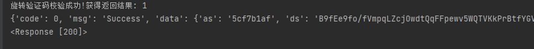

# 百度旋转验证码逆向

## 介绍
> 最新版百度验证码逆向,百分之九十代码是用python实现,校验验证码接口返回op=1

> 旋转验证码识别模型为 [rotate_image_classifier](https://github.com/HarderThenHarder/rotate_image_classifier) 
## 使用说明
> 运行 aqc_spin_v2.py

> 结果:
> 

## 如果能用,可以帮忙点个star吗^^